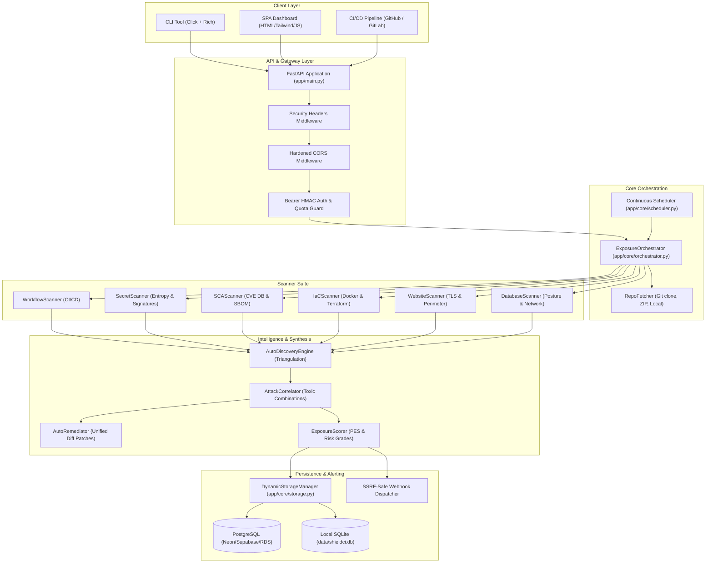
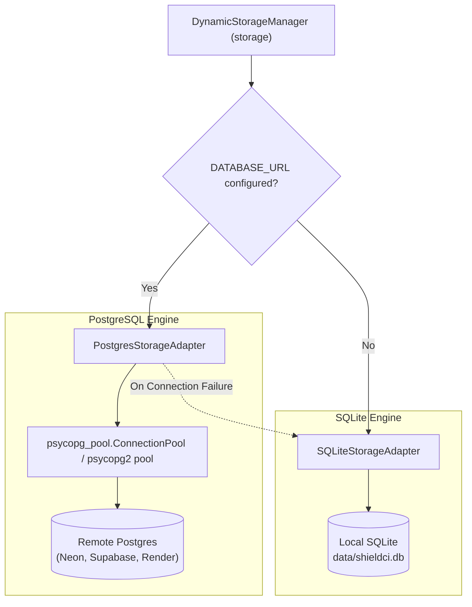

# ShieldCI: System Architecture & Technical Design

This document details the architectural principles, component interactions, mathematical models, and security guarantees underpinning the **ShieldCI DevSecOps CI/CD Exposure Manager**.

---

## Table of Contents

- [Architectural Overview](#architectural-overview)
- [Component Topology](#component-topology)
- [End-to-End Scan Execution Flow](#end-to-end-scan-execution-flow)
- [Tri-Vector Detection Architecture](#tri-vector-detection-architecture)
- [Auto-Discovery & Footprint Triangulation](#auto-discovery--footprint-triangulation)
- [Attack Correlation & Toxic Combinations](#attack-correlation--toxic-combinations)
  - [Attack Graph Schema](#attack-graph-schema)
  - [Exploitability Index (EI) Formula](#exploitability-index-ei-formula)
  - [Correlated Attack Scenarios](#correlated-attack-scenarios)
- [Autonomous Remediation & Unified Diff Engine](#autonomous-remediation--unified-diff-engine)
- [Pipeline Exposure Scoring (PES) Model](#pipeline-exposure-scoring-pes-model)
- [Dual-Engine Storage Architecture](#dual-engine-storage-architecture)
  - [Connection Pooling & Failover](#connection-pooling--failover)
  - [Schema & Database Abstraction](#schema--database-abstraction)
- [Security & Defense-in-Depth Primitives](#security--defense-in-depth-primitives)
  - [Anti-SSRF Validation Engine](#anti-ssrf-validation-engine)
  - [Cryptographic Authentication & Session Revocation](#cryptographic-authentication--session-revocation)
  - [HTTP Security Middleware](#http-security-middleware)

---

## Architectural Overview

ShieldCI is built to solve a critical limitation of traditional vulnerability scanners: **siloed risk detection**. Traditional tools treat repository code, live web perimeters, and databases as separate domains. ShieldCI unifies these into a **Tri-Vector Posture Management** engine that:

1. Ingests source code, container configurations, live web URLs, and database connection strings.
2. Identifies individual misconfigurations and vulnerabilities across all three vectors.
3. Automatically triangulates hidden infrastructure footprints from repository manifests.
4. Correlates multi-vector findings into actionable **Toxic Combinations**.
5. Computes a mathematically grounded **Pipeline Exposure Score (PES)**.
6. Emits executable **1-Click Self-Healing Git Patches** (`git apply`).

---

## Component Topology



---

## End-to-End Scan Execution Flow

The scan lifecycle follows a strictly ordered synchronous or asynchronous execution pipeline:

```
[Target Input] ──► [Target Classification]
                        │
         ┌──────────────┼──────────────┐
         ▼              ▼              ▼
   [Repository]     [Website]      [Database]
         │              │              │
         ▼              │              │
   [RepoFetcher]        │              │
   (Clone/Unpack)       │              │
         │              │              │
         ▼              ▼              ▼
   [Static Scans]   [Web Probes]   [DB Probes]
   (Workflow,       (TLS, Headers, (Socket, Auth,
    Secret, SCA,     CORS, Paths)   Credentials)
    IaC/Docker)         │              │
         │              │              │
         └──────────────┼──────────────┘
                        │
                        ▼
           [Auto-Discovery Engine]
        (Triangulate Web/DB footprints)
                        │
                        ▼
          [Attack Correlation Engine]
      (Map Toxic Combinations & Graph)
                        │
                        ▼
           [Auto-Remediation Engine]
        (Generate unified git patches)
                        │
                        ▼
             [Exposure Scorer (PES)]
          (Calculate score & risk grade)
                        │
                        ▼
             [Storage Persistence]
         (PostgreSQL pool or SQLite)
                        │
                        ▼
           [SSRF-Hardened Webhook]
       (Dispatch alert if gate failed)
```

---

## Tri-Vector Detection Architecture

### Vector 1: Codebase & CI/CD Posture
- **`WorkflowScanner`**: Parses GitHub Actions (`.github/workflows/*.yml`) and GitLab CI (`.gitlab-ci.yml`). Identifies insecure triggers (`pull_request_target`), excessive permissions (`write-all`), mutable unpinned 3rd-party action tags, and script injection vectors (`${{ github.event... }}`).
- **`SecretScanner`**: Dual-engine detection combining regex signatures for high-risk tokens (AWS, GitHub, Slack, Private Keys) with Shannon Entropy calculation to catch unclassified high-randomness tokens.
- **`SCAScanner`**: Extracts package dependencies from `requirements.txt`, generates Package URLs (PURL), compares against an embedded CVE advisory database, and detects vulnerable libraries.
- **`IaCScanner`**: Analyzes `Dockerfile` files for `:latest` unpinned base images, default root user execution, and exposed administrative ports (22, 3389). Analyzes `.tf` files for `0.0.0.0/0` ingress CIDRs.

### Vector 2: Live Web Perimeter & APIs
- **`WebsiteScanner`**: Performs non-destructive audits against live HTTP/HTTPS services.
  - Inspects SSL/TLS certificates for expiration dates, untrusted root CAs, and weak protocol versions (TLS 1.0, 1.1).
  - Evaluates defense-in-depth security response headers (`Strict-Transport-Security`, `Content-Security-Policy`, `X-Frame-Options`, `X-Content-Type-Options`, `Referrer-Policy`).
  - Flags dangerous CORS wildcards paired with credentials (`Access-Control-Allow-Credentials: true`).
  - Detects server banner disclosures and probes sensitive paths (`/.env`, `/.git/HEAD`, `/actuator/env`).

### Vector 3: Database Posture & Network Access
- **`DatabaseScanner`**: Non-destructive posture evaluation for PostgreSQL, MySQL, Redis, MongoDB, Elasticsearch, and MSSQL.
  - Audits connection URIs for cleartext credentials and weak/default passwords (`root`, `admin`, `password`).
  - Verifies transport layer encryption enforcement (`sslmode=require`).
  - Performs network socket reachability checks on default and custom ports.
  - Conducts safe, unauthenticated protocol probes (e.g., Redis `PING` response, Elasticsearch `_cluster/health` status).

---

## Auto-Discovery & Footprint Triangulation

The **`AutoDiscoveryEngine`** bridges static code analysis with live infrastructure security. By inspecting configuration artifacts, it extracts live infrastructure footprints without requiring manual asset inventory:

1. **Docker Compose Inspection**: Scans `docker-compose.yml`, `compose.yaml`, and environment variations. Detects container services, exposed port bindings, and database images (Postgres, MySQL, Mongo, Redis, Elasticsearch).
2. **Environment Variable Extraction**: Parses `.env`, `.env.example`, `.env.staging`, and `config.env`. Extracts live URLs (`https?://...`) and database URIs (`postgres://`, `redis://`, etc.).
3. **CI/CD Service Containers**: Parses GitHub Actions workflow `services:` definitions and deployment action steps.
4. **Package Manifests**: Extracts development servers and proxy targets from `package.json`.

When the user triggers a scan with `--auto-triangulate` or calls `POST /api/scan/triangulate`, ShieldCI uses these discovered assets to launch secondary scans against live perimeters.

---

## Attack Correlation & Toxic Combinations

Isolated vulnerabilities often have low individual severity. However, when combined in an environment, they form **Toxic Combinations** that allow threat actors to achieve full system compromise.

### Attack Graph Schema

The attack graph maps threats across five distinct categories:

| Category | Role in Graph | Example Node |
| :--- | :--- | :--- |
| `actor` | Threat origin | External Anonymous Attacker |
| `ingress` | Initial foothold or exposure | Publicly Accessible Port 5432, Insecure PR Trigger |
| `vulnerability` | Exploit bridge | Leaked DB Password, Script Injection Vector |
| `asset` | High-value target / Crown Jewels | Production Database, AWS Production Secrets |
| `exfiltration` | Terminal business impact | Full Data Breach, Cloud Takeover |

### Exploitability Index (EI) Formula

The Exploitability Index is a scalar metric between `0.0` and `100.0` representing how easily an external actor can weaponize the discovered attack surface:

$$\text{EI} = \min\left(100.0, \sum_{c \in \text{ToxicCombos}} (\text{Weight}(c.\text{severity}) \times \text{LikelihoodMultiplier}(c))\right)$$

Where:
- $\text{Weight}(\text{CRITICAL}) = 35.0$
- $\text{Weight}(\text{HIGH}) = 20.0$
- $\text{Weight}(\text{MEDIUM}) = 10.0$
- $\text{LikelihoodMultiplier}(\text{High/Direct}) = 1.0$
- $\text{LikelihoodMultiplier}(\text{Moderate}) = 0.75$

### Correlated Attack Scenarios

```
Scenario 1: Leaked Database Credentials + Open Database Port
[Threat Actor] ──► [Reads Leaked Password in Code] ──► [Connects to Public Port 5432] ──► [Full Data Dump]

Scenario 2: CI/CD Pipeline Hijacking & Cloud Takeover
[Untrusted Fork PR] ──► [Triggers pull_request_target] ──► [PR Shell Extracts AWS_SECRET] ──► [Cloud Account Takeover]

Scenario 3: Container RCE & Host Privilege Escalation
[Vulnerable Library CVE] ──► [Remote Code Execution in Web App] ──► [Process Runs as Root (UID 0)] ──► [Host Breakout]

Scenario 4: Web Information Disclosure to Lateral Pivot
[Public /.env File Probe] ──► [Discloses Internal Service Key] ──► [Bypasses Internal API Auth] ──► [Lateral Movement]
```

---

## Autonomous Remediation & Unified Diff Engine

The **`AutoRemediator`** synthesizes standard unified diff patches (`.patch`) directly from scan findings.

### Dockerfile Remediation
Analyzes the parsed lines of a Dockerfile:
- If no `USER` instruction is detected, injects `USER 10001` before the execution command.
- If a base image uses `:latest` or is untagged, replaces it with an immutable tag (e.g. `:slim-bullseye`).

### Workflow Remediation
Locates the `on: pull_request_target` trigger line and replaces it with `on: pull_request`, neutralizing fork credential exposure while preserving intended CI test behavior.

### Dependency (SCA) Remediation
Parses `requirements.txt` lines and upgrades vulnerable package versions to known-safe releases:
- `requests` $\rightarrow$ `2.32.3`
- `urllib3` $\rightarrow$ `2.2.2`
- `pyyaml` $\rightarrow$ `6.0.1`
- `flask` $\rightarrow$ `3.0.3`
- `django` $\rightarrow$ `5.0.7`

### Web Security Configurations
When web applications lack security headers, the remediator outputs hardened configuration blocks for **Nginx** and **Caddy**:
```nginx
# Nginx Hardened Response Headers
add_header Strict-Transport-Security "max-age=31536000; includeSubDomains" always;
add_header X-Content-Type-Options "nosniff" always;
add_header X-Frame-Options "SAMEORIGIN" always;
add_header Referrer-Policy "strict-origin-when-cross-origin" always;
add_header Content-Security-Policy "default-src 'self';" always;
```

---

## Pipeline Exposure Scoring (PES) Model

The **Pipeline Exposure Score (PES)** calculates asset risk based on weighted severity sums:

$$\text{RawScore} = 25.0 \cdot N_{\text{crit}} + 12.0 \cdot N_{\text{high}} + 4.0 \cdot N_{\text{med}} + 1.0 \cdot N_{\text{low}}$$

$$\text{PES} = \min(100.0, \text{Round}(\text{RawScore}, 1))$$

### Quality Gate Enforcement Logic
A scan passes the Quality Gate (`policy_passed == True`) if and only if:
1. $\text{PES} \le \text{MaxAllowedPES}$ (default: `60.0`).
2. No findings exceed or equal the configured `fail_on_severity` threshold:
   - If `fail_on_severity == CRITICAL`, fail if $N_{\text{crit}} > 0$.
   - If `fail_on_severity == HIGH`, fail if $N_{\text{crit}} > 0$ or $N_{\text{high}} > 0$.
   - If `fail_on_severity == MEDIUM`, fail if $N_{\text{crit}} > 0$ or $N_{\text{high}} > 0$ or $N_{\text{med}} > 0$.
3. If `AUTO_FAIL_ON_TOXIC_COMBOS == True`, the build automatically fails if any Toxic Combinations are detected, regardless of raw PES score.

---

## Dual-Engine Storage Architecture

ShieldCI incorporates an enterprise storage engine capable of running in zero-dependency environments (SQLite) and scaling to production serverless architectures (PostgreSQL).



### Connection Pooling & Failover
- **PostgreSQL**: Leverages `psycopg3` with `psycopg_pool.ConnectionPool` (minimum 2, maximum 10 connections). Supports `psycopg2` as an automatic alternative.
- **Failover**: If the remote PostgreSQL database is unreachable during startup or query execution, ShieldCI catches the connection error, logs a warning, and gracefully falls back to local SQLite without crashing the service.
- **Serverless Handling**: In ephemeral serverless environments (Vercel, AWS Lambda), if SQLite is used, ShieldCI automatically copies the bundled seed database to the writable `/tmp/shieldci_data/` directory.

### Schema & Database Abstraction
Both adapters maintain identical table schemas across:
- `scans`: Complete scan records, JSON payloads, PES scores, and user scoping.
- `schedules`: Continuous monitoring jobs and interval timers.
- `users`: User profiles, PBKDF2 password hashes, cryptographic salts, and roles.
- `settings`: Persisted quality gate rules and scanner thresholds.
- `guest_quotas`: IP-based daily scan rate-limiting tables.

---

## Security & Defense-in-Depth Primitives

### Anti-SSRF Validation Engine

Outbound requests (such as webhook alerts or user-supplied website scans) must pass through `app/core/security.validate_safe_url`.

The validation engine executes the following security checks:
1. **Scheme Validation**: Strictly allows `http` and `https`.
2. **Host Blacklisting**: Blocks known cloud metadata endpoints (`169.254.169.254`, `metadata.google.internal`, `instance-data`) and local loopbacks (`localhost`, `127.0.0.1`, `::1`).
3. **Pre-Flight DNS Resolution**: Resolves hostname into all IPv4 and IPv6 target addresses via `socket.getaddrinfo`.
4. **IP Subnet Verification**: Uses Python's `ipaddress` library to reject addresses that are:
   - Loopback (`127.0.0.0/8`, `::1`)
   - Private RFC 1918 (`10.0.0.0/8`, `172.16.0.0/12`, `192.168.0.0/16`)
   - Link-local / APIPA (`169.254.0.0/16`, `fe80::/10`)
   - Multicast or Unspecified (`224.0.0.0/4`, `0.0.0.0`)

### Cryptographic Authentication & Session Revocation

1. **Password Security**:
   - Algorithms: PBKDF2-HMAC-SHA256 with 200,000 iterations.
   - Salt: 16 bytes (32 hex characters) of cryptographically secure random bytes via `secrets.token_bytes(16)`.
   - Comparison: Constant-time verification using `hmac.compare_digest` to prevent timing attacks.
2. **Stateless Access Tokens**:
   - Format: `base64url(header).base64url(payload).base64url(signature)`
   - Signature: HMAC-SHA256 using a persisted 32-byte secret key (`SHIELDCI_SECRET_KEY`).
   - Claims: `sub` (user ID), `email`, `ver` (token version), `iat`, `exp` (7 days default).
3. **Instant Session Revocation**:
   - Every user record contains a `token_version` integer.
   - When a user changes their password or an administrator modifies their role, `token_version` increments by 1.
   - Any token presented with an older `ver` claim is immediately rejected with `401 Unauthorized`.

### HTTP Security Middleware

All HTTP responses pass through security header middleware injecting:
- `X-Content-Type-Options: nosniff`
- `X-Frame-Options: DENY`
- `X-XSS-Protection: 1; mode=block`
- `Referrer-Policy: strict-origin-when-cross-origin`
- `Permissions-Policy: camera=(), microphone=(), geolocation=()`
- `Content-Security-Policy`: Restricts script and asset execution to origin and trusted CDNs.
- `Strict-Transport-Security`: `max-age=31536000; includeSubDomains` (when served over HTTPS).
